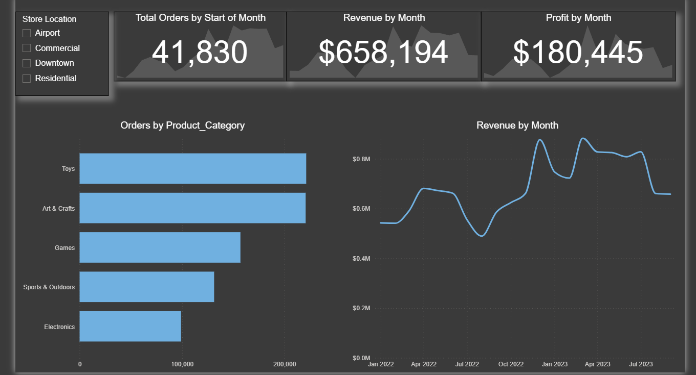

# 🧸 Toy Store KPI Project – Power BI Dashboard

This project presents an interactive Power BI dashboard designed to analyze key performance indicators (KPIs) of toy store operations across multiple locations.

The goal was to gain actionable insights on product performance, inventory management, and sales behavior through visual analytics.

 

---

## 🎯 Key Business Questions Answered

1. **Which product categories drive the biggest profits?**  
   → Identified the most profitable product categories and evaluated whether this trend holds across different store locations.

2. **Is this the same across store locations?**  
   → Compared category-level profitability by region to uncover geographic performance differences.

3. **Can you find any seasonal trends or patterns in the sales data?**  
   → Explored sales trends over time to identify seasonal spikes and dips across years and product lines.

4. **Are sales being lost with out-of-stock products at certain locations?**  
   → Analyzed inventory vs. demand to detect potential lost sales due to stockouts in specific stores.

5. **How much money is tied up in inventory at the toy stores? How long will it last?**  
   → Calculated inventory value and estimated inventory turnover rate to assess operational efficiency.

---

## 📊 Dashboard Features

- Filterable by store location, product category, and date range
- Visual breakdown of revenue, profit, inventory, and unit sales
- Time-series visualizations for trend analysis
- Inventory status and forecast metrics

---

## 🛠️ Tools & Technologies

- **Power BI**
- Data Modeling (Relationships, DAX)
- Interactive Visualizations
- KPI Indicators & Time Intelligence

---

## 📎 File Structure

- `Toy_Store_KPI_Report.pbix` – Power BI project file
- `README.md` – Project documentation

---

## 🙋‍♂️ Author

**Giray Şengönül**  
Data Analyst | SQL | Power BI | Python  
[LinkedIn](https://www.linkedin.com/in/giray-sengonul-168420318/) • [Portfolio](https://giraysengonul.cv/)

---

## ⭐ Feedback & Contributions

If you found this project useful or inspiring, feel free to star ⭐ the repo or connect with me on LinkedIn! Feedback is always welcome.
